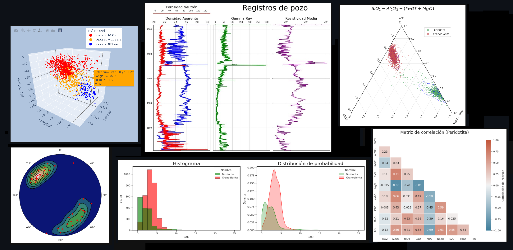

# Python para Geólogos
### **Versión: 1.9 (Noviembre 2022)**
***

***

### **Editado por: Kevin Alexander Gómez**
#### Contacto: kevinalexandr19@gmail.com | [Linkedin](https://www.linkedin.com/in/kevin-alexander-g%C3%B3mez-2b0263111/) | [Github](https://github.com/kevinalexandr19)
***
### **¿Quieres probar el código en menos de 2 minutos y sin necesidad de instalar Python?**
Ingresa a la aplicación haciendo clic aquí ☞ 

Si tienes cuenta en Github, no olvides darle una estrella al proyecto para que siga creciendo ⭐

***
## Descripción
Este manual ha sido creado con la finalidad de facilitar el aprendizaje en Python a estudiantes y profesionales en el campo de la Geología.

Es recomendable tener conocimientos previos en geología general, estadística y álgebra lineal.\
También es importante tener perseverancia para aprender cada tema y creatividad para resolver problemas.

## Objetivos del proyecto
- Aprender a desarrollar código usando Python.
- Desarrollar un pensamiento algorítmico.
- Aprender a usar Python para solucionar problemas en Geología.

***
## **Índice** 
Todos los capítulos están disponibles dentro del repositorio como notebooks de Jupyter `.ipynb`.

1. Fundamentos de Python\
  1a. Python básico\
  1b. Numpy\
  1c. Pandas\
  1d. Matplotlib\
  1e. Ejercicios de Python en Geología\
  1f. Ejercicios resueltos de Python en Geología
2. Estadística y Visualización de datos\
  2a. Bootstrap\
  2b. Análisis descriptivo\
  2c. Ejemplos de visualización de datos\
  2d. Visualización de sondajes en 3D\
  2e. Visualización de un modelo de bloques en 3D
3. Ciencia de datos y Machine Learning\
  3a. Seaborn\
  3b. Agregando interactividad dentro de Python\
  3c. Árboles de decisión
4. Geoestadística\
  4a. Introducción al Variograma\
  4b. Variograma 1D\
  4c. Declustering\
  4d. Interpolación 2D - Inverso de la distancia
5. Geoquímica\
  5a. Pyrolite
6. Geofísica\
  6a. Visualizando registros de pozo
7. Geología estructural\
  7a. Mplstereonet\
  7b. Red estereográfica interactiva
8. Geotecnia\
  8a. Estimación de la probabilidad de falla en un talud
  
### Plantillas de trabajo
- Plantilla para visualizar sondajes en 3D

Es altamente recomendable usar Binder para interactuar con los notebooks.\
Alternativamente, puedes clonar el repositorio y usarlos como plantilla o reusar el código para desarrollar tus propios notebooks.

***
### ¿Cómo usar este manual?
El manual contiene documentos en formato `.ipynb` y se pueden abrir de las siguientes formas:
- A través de un navegador web, usando la aplicación de `Google Colab`.
- Usando `Binder`, una aplicación web que permite ejecutar código arbitrario dentro de un entorno virtual (similar a `Google Colab`).
- A través de un editor de código instalado en tu computadora, como por ejemplo: `Jupyter Lab`, `Jupyter Notebook` o `Visual Studio Code`.

Si no tienes instalado `Python`, puedes seguir las indicaciones del archivo `Anexos.ipynb`.

***
### Referencias
- Barbieri, R., Garelik, C. (2022). [La matemática y las geociencias](https://editorial.unrn.edu.ar/index.php/catalogo/346/view_bl/62/lecturas-de-catedra/106/la-matematica-y-las-geociencias?tab=getmybooksTab&is_show_data=1). Editorial UNRN (pp. 15 y 136).
- Mälicke, M. (2022). [SciKit-GStat 1.0: a SciPy-flavored geostatistical variogram estimation toolbox written in Python](https://gmd.copernicus.org/articles/15/2505/2022). European Geosciences Union, Volume 15, issue 6. Institute for Water and River Basin Management, Karlsruhe Institute of Technology (KIT), Karlsruhe, Germany.
- Marsden, Eric. (2021). [Monte Carlo simulation for estimating slope failure risk](https://risk-engineering.org/notebook/monte-carlo-slope-stability.html).
- Petrelli, M. (2021). [Introduction to Python in Earth Science Data Analysis](https://link.springer.com/book/10.1007/978-3-030-78055-5). Repositorio en [Github](https://github.com/petrelli-m/python_earth_science_book)
- Pyrcz, M. (2020). [Python Numerical Demos](https://github.com/GeostatsGuy/PythonNumericalDemos).
- Suarez-Burgoa, L. (2017). [Matematización de la geología](https://www.researchgate.net/publication/313464003_Matematizacion_de_la_geologia). Boletín de Ciencias de la Tierra 41 (pp. 30 - 38). Universidad Nacional de Colombia.

